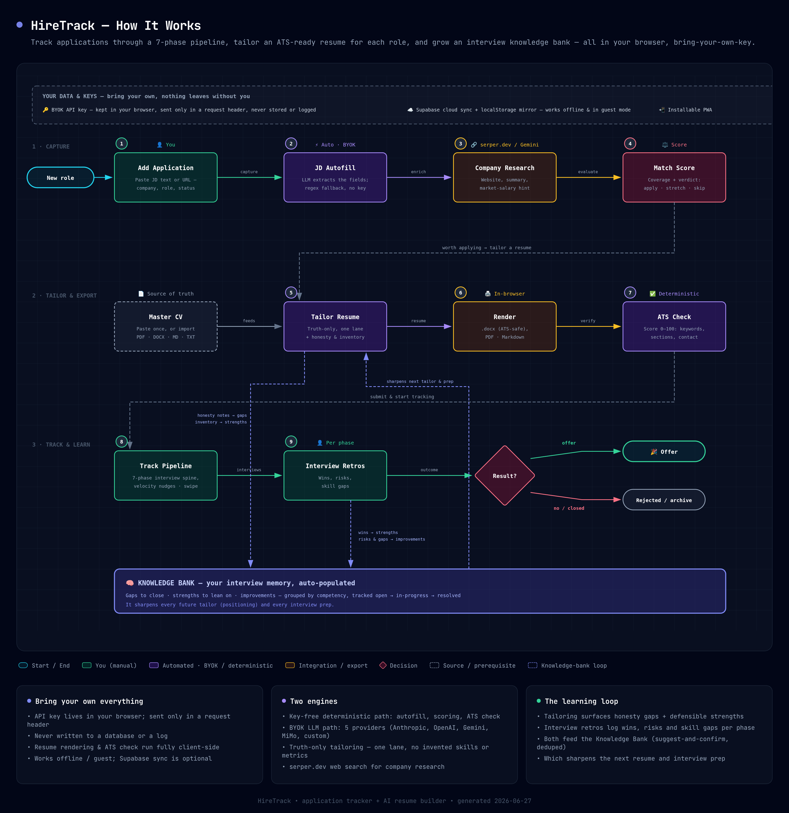

# HireTrack: Developer Job Opportunity Tracker & Supabase Bridge

HireTrack is a premium, high-fidelity developer application for tracking active software-engineering pipelines — interview rounds, salaries, benefits and technical criteria — **and** an AI, bring-your-own-key résumé builder that tailors an ATS-ready résumé to each job and grows an interview knowledge bank from your retros. Everything runs in your browser; cloud sync is optional.

It is currently deployed live on Vercel at: **[https://job-application-tracker-sigma-liard.vercel.app/](https://job-application-tracker-sigma-liard.vercel.app/)**

---

## 🧭 How It Works

Track applications through a 7-phase pipeline, tailor an ATS-ready resume for each role, and grow an interview knowledge bank — all in your browser, bring-your-own-key.



> The diagram source is [`docs/hiretrack-flow.html`](docs/hiretrack-flow.html) — open it in a browser and use the `⋯` menu to re-export the PNG/PDF.

---

## 🚀 Key Features

### Track
*   **7-Phase Application Pipeline**: Track stages from initial submission, recruiter prescreens, technical deep-dives, systems-architecture rounds, to final decision makers and negotiations.
*   **Purpose-driven detail pane**: Status header with next-action, a velocity-aware pipeline spine (time-in-stage with stall → follow-up nudges), and collapsible Details / Contacts / Retros.
*   **Per-phase interview retros**: Capture wins, risks and skill gaps as you go — they feed the Knowledge Bank.
*   **Pipeline analytics**: Generic, privacy-safe stats over your own pipeline (no company-specific logic anywhere).

### Tailor (AI Resume Builder · bring-your-own-key)
*   **JD autofill** from pasted text or a URL — an LLM extracts company, role, work model, salary, requirements and tech tags, with a key-free deterministic fallback.
*   **Company research** via [serper.dev](https://serper.dev) web search (or Gemini grounding) — website, summary, and a *market-salary hint only when none was posted*.
*   **Match & positioning score** — deterministic keyword coverage plus an optional LLM verdict: **apply · stretch · skip**.
*   **Truth-only tailoring** — one defensible lane, JD-phrasing mirrored, **no invented skills, metrics, years or contact details**; every run appends a *Tailoring Inventory* and *Honesty & Verification Notes*.
*   **Export** — single-column **ATS-safe `.docx`**, a designed **PDF** (print → Save as PDF), or **Markdown** — all rendered client-side; the resume never leaves your browser.
*   **Deterministic ATS check** — a 0–100 score (keyword coverage, standard sections, parseable contact, ATS-safe formatting, length) with matched/missing keyword chips.

### Learn
*   **Knowledge Bank** — your interview memory, **auto-populated** from tailoring (honesty gaps → *gaps*, inventory → *strengths*) and interview retros (wins → *strengths*, risks/gaps → *improvements*). Grouped by competency, tracked **open → in-progress → resolved**, and it sharpens every future tailor and prep.

### Platform
*   **Bring-your-own-key (BYOK)**: 5 providers — **Anthropic, OpenAI, Gemini, Xiaomi MiMo, and any custom OpenAI-compatible endpoint**. Keys live in your browser and travel only in a request header — never stored on a server or logged.
*   **Offline-first & guest mode**: Reads/writes `localStorage` instantly and mirrors to Supabase in the background; the app is fully usable with no account and no env vars.
*   **Installable PWA**: Offline app-shell, installable on desktop and mobile, with bottom-nav, bottom-sheets and swipe gestures on touch.
*   **Aesthetic glass UI**: Elegant glassmorphic dark/light theme with responsive, accessible (focus rings, reduced-motion, skip-link) layouts.

---

## 🔐 Privacy & Your Data

HireTrack is **bring-your-own-everything**:

*   Your **API key** is kept in `localStorage` and sent only in the `X-API-Key` request header — it is **never written to a database or a log**.
*   Resume **rendering and the ATS check run entirely in your browser** — the resume text is sent only to the AI provider *you* choose, and only when you click Generate.
*   Supabase cloud sync is **optional**; without it (or in guest mode) everything works offline against `localStorage`.
*   A privacy note in-app reminds you that paid Anthropic/OpenAI don't train on your prompts, while some free tiers (including behind custom endpoints) may log or train — so avoid them for sensitive data.

---

## 🛠️ Supabase Configuration, Auth & Setup Instructions

To hook up your Supabase database with your Vercel deployment and enable secure multi-user Google/Email accounts:

### 1. Setup the Database Schema

Choose one of the two methods below to initialize or update your Supabase database schema:

#### Option A: Automated Database Migration (Super Easy)
We have provided an automated migration script that connects directly to your Supabase PostgreSQL database to create the tables, verify columns, and configure security permissions.

1. In your `.env` file, add your **Database Password** (defined during your Supabase project creation):
   ```env
   SUPABASE_DB_PASSWORD="your-supabase-db-password"
   ```
   *Alternatively, you can provide the full `DATABASE_URL` transaction/session connection string.*
2. Run the migration script command:
   ```bash
   npm run db:migrate            # base job_applications table
   npm run db:migrate:pipeline   # AI pipeline tables (resume builder + knowledge bank)
   ```
   > The resume builder and Knowledge Bank store data in additional tables (`master_resume`, `tailored_resumes`, `profile_entries`, `contacts`, `outreach`, …), all RLS-scoped to the signed-in user. `db:migrate:pipeline` applies them. These features also work fully offline against `localStorage` if you skip this.

#### Option B: Manual SQL Editor (Fallback)
Log in to your **Supabase Dashboard**, select your project, open the **SQL Editor**, create a **New Query**, paste the following script (also saved in `supabase/migrations/20260624000000_setup_job_applications.sql`), and click **Run**:

```sql
create table if not exists public.job_applications (
  "id" text primary key,
  "companyName" text not null,
  "targetRole" text not null,
  "workModel" text not null,
  "location" text,
  "salaryRange" text,
  "otherBenefits" text,
  "hrContact" text,
  "appliedVia" text not null,
  "resumeLink" text,
  "portfolioLink" text,
  "keyJdRequirements" text,
  "currentStatus" text not null,
  "phases" jsonb not null default '[]'::jsonb,
  "postMortem" jsonb not null default '{}'::jsonb,
  "createdAt" text not null,
  "userId" uuid references auth.users(id) on delete cascade -- Relational foreign key linked directly to Supabase Auth users
);

-- Enable Row Level Security (RLS) for enterprise-grade privacy and data isolation
alter table public.job_applications enable row level security;

-- Create RLS Policies to automatically isolate and protect user-specific data
drop policy if exists "Users can view own applications" on public.job_applications;
create policy "Users can view own applications" 
  on public.job_applications for select 
  using (auth.uid() = "userId" or "userId" is null);

drop policy if exists "Users can insert own applications" on public.job_applications;
create policy "Users can insert own applications" 
  on public.job_applications for insert 
  with check (auth.uid() = "userId" or "userId" is null);

drop policy if exists "Users can update own applications" on public.job_applications;
create policy "Users can update own applications" 
  on public.job_applications for update 
  using (auth.uid() = "userId" or "userId" is null)
  with check (auth.uid() = "userId" or "userId" is null);

drop policy if exists "Users can delete own applications" on public.job_applications;
create policy "Users can delete own applications" 
  on public.job_applications for delete 
  using (auth.uid() = "userId" or "userId" is null);
```

### 2. Configure Google Sign-In Provider (Optional but Recommended)
1. Go to the **Google Cloud Console**, create a project, and navigate to **APIs & Services > OAuth consent screen**. Create an **External** screen.
2. Under **Credentials > Create Credentials**, select **OAuth client ID** and set the application type to **Web Application**.
3. In your **Supabase Dashboard**, navigate to **Authentication > Providers > Google**. Enable Google, and copy the **Redirect URI**.
4. Paste this Redirect URI into Google Cloud Console's **Authorized redirect URIs** section, then save to generate your **Client ID** and **Client Secret**.
5. Paste these Google credentials back into your Supabase Google Provider panel and click **Save**. You are now ready to log in with Google popups!

### 3. Configure Environment Variables

Create a `.env` file in your workspace root (or set them directly in Vercel):

```env
# Client environment variables prefix for Vite compilation
VITE_SUPABASE_URL=https://your-project-id.supabase.co
VITE_SUPABASE_ANON_KEY=your-anon-public-api-key
```

> **AI provider keys are NOT environment variables.** They are entered in-app (the **API Keys** view), stored only in your browser, and sent per-request in the `X-API-Key` header. The app never reads provider keys from `.env` or bakes them into the bundle.

### 3. Deploy to Vercel
1. Go to your **Vercel Dashboard** and click on your HireTrack project.
2. Navigate to **Settings** > **Environment Variables**.
3. Add `VITE_SUPABASE_URL` and `VITE_SUPABASE_ANON_KEY` with the credentials obtained from your Supabase settings page.
4. Go to **Deployments**, choose your latest commit, click **Redeploy** (or push a new commit) to compile the credentials into the client-side bundle.

---

## 📦 Local Installation & Development

```bash
# Install dependencies
npm install

# Frontend dev server on http://localhost:3000
npm run dev

# Local API server on http://localhost:3001 (serverless handlers via Express)
npm run dev:api

# Both together (Vite + API) — needed to exercise the AI features locally
npm run dev:all

# Type-check / lint
npm run lint

# Build production artifact (PWA service worker is emitted on build)
npm run build
```

The same framework-agnostic handlers under `api/**` run as **Vercel serverless functions** in production and via **Express** (`server/dev-api.ts`) locally — one source, two runtimes.

---

## 🧱 Tech Stack

*   **Frontend**: React 19, Vite, TypeScript, Tailwind CSS v4, Framer Motion, lucide-react — single-page app, deployed on Vercel.
*   **Backend**: Stateless serverless functions (`api/**`) that proxy BYOK calls to AI providers (`fetch`, no SDKs); Supabase Postgres + Auth (RLS) for data only — never for AI compute.
*   **AI providers**: Anthropic, OpenAI, Gemini, Xiaomi MiMo, and any custom OpenAI-compatible endpoint; [serper.dev](https://serper.dev) for web-search research.
*   **Client-side document tooling**: `docx` (ATS-safe Word), browser print-to-PDF, and `mammoth` / `pdfjs` / `turndown` for importing an existing résumé (PDF/DOCX/MD/TXT → Markdown).

> Architecture, design rules and data contracts live in **`AGENTS.md`** (the project bible) and **`CLAUDE.md`**; pipeline and design docs are under **`docs/`**.

---

*Keep track of your interview pipeline cleanly and secure your next big engineering role!*
